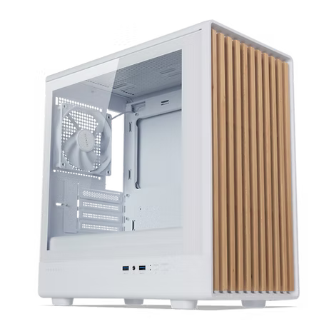

✨ Lagi cari inspirasi PC build serba putih yang nggak cuma kencang tapi juga kece di meja kerja? Rakitannya dirancang buat kamu yang suka tampilan clean dan minimalis, tapi tetap butuh performa tinggi buat gaming, editing, atau multitasking berat. Estetika putihnya dipadukan dengan elemen natural dari casing beraksen kayu bikin tampil beda. 

## 🧠 Prosesor – AMD Ryzen 5 7500F – **Rp2.239.000**
  
Prosesor 6-core 12-thread generasi terbaru berbasis Zen 4 tanpa iGPU, ideal untuk build yang hemat tapi kencang.  
👉 [Lihat detail prosesor]()

---

## 🧩 Motherboard – ASRock B650M Pro RS – **Rp2.400.000**
  
Motherboard AM5 dengan PCIe 5.0 dan DDR5. Fitur lengkap dan siap upgrade jangka panjang.  
👉 [Lihat motherboard ini](/post/asrock-b650m-pro-rs)

---

## ⚡ Storage – Crucial P3 Plus 1TB Gen 4 – **Rp1.105.000**
  
SSD NVMe Gen 4 super cepat dengan kecepatan hingga 5000MB/s. Cocok buat loading game dan kerja berat.  
👉 [Detail SSD ini](/post/crucial-p3-plus-1tb)

---

## 🧠 RAM – Klevv Fit DDR5 2x16GB 5600MHz CL30 – **Rp1.450.000**
  
RAM DDR5 dual channel 32GB, performa tinggi dengan latency CL30.  
👉 [Cek detail RAM ini](/post/klevv-fit-ddr5-5600)

---

## 🎮 GPU – ASRock Radeon RX 9060 XT 16GB Steel Legend OC – **Rp7.030.000**
  
GPU kelas menengah dengan VRAM 16GB, cocok banget buat gaming 1440p dan editing.  
👉 [Review lengkap GPU ini](/post/asrock-rx-9060xt-steellegend)

---

## 🔌 PSU – Fractal Ion+ 2 560W 80+ Platinum – **Rp1.117.000**
  
Power supply modular dengan efisiensi platinum. Suara senyap dan komponen premium.  
👉 [Lihat PSU ini](/post/fractal-ion-2-560w)

---

## 🧱 Casing – Tecware Timber M – **Rp550.000**
  
Casing mid-tower dengan airflow baik, desain modern, dan kabel management gampang.  
👉 [Lihat casing ini](/post/tecware-timber-m)

---

## 🌬️ Cooler – Ocypus Iota A40 BK – **Rp340.000**  
  
Pendingin udara dengan display digital suhu dan desain solid.  
👉 [Lihat cooler ini](/post/ocypus-iota-a40)

---

## 📊 Benchmark (Estimasi)
- Cyberpunk 2077 – 1440p High: ~72 fps
- Valorant – 1080p Ultra: ~270 fps
- Blender (Render 4K): 1m 25s (CPU), 38s (GPU)

---

## 🧾 Kesimpulan
 Build ini cocok banget buat yang pengen PC dengan karakter — bukan cuma mesin kencang, tapi juga punya nilai estetika. Casing Tecware Timber M hadir dengan nuansa putih dan aksen kayu asli, berpadu rapi dengan komponen lainnya yang dominan putih. Desain bersih, rapi, dan siap jadi pusat perhatian di setup kamu. Semua part tersedia di Indonesia dan bisa kamu cek lewat link masing-masing.

**Total Harga (tanpa monitor & peripheral)**:  
🧾 Rp2.239.000

➕ Rp2.400.000
 
➕ Rp1.105.000  

➕ Rp1.450.000  

➕ Rp7.030.000

➕ Rp1.117.000

➕ Rp550.000

➕ Rp340.000

**= Rp16.231.000**

💡 *Harga monitor dan peripheral tidak dihitung di sini.*

Kalau kamu mau rakit build serupa, tinggal ganti komponen sesuai kebutuhan. Jangan lupa sesuaikan budget ya! 💸

---

💬 Punya rekomendasi part lain? Atau mau tanya performa build ini? Drop komentar atau kunjungi halaman komponen masing-masing buat diskusi!

---

> Dibuat oleh Tim **PCsentral** – Semua Tentang PC, dalam Satu Sentral.